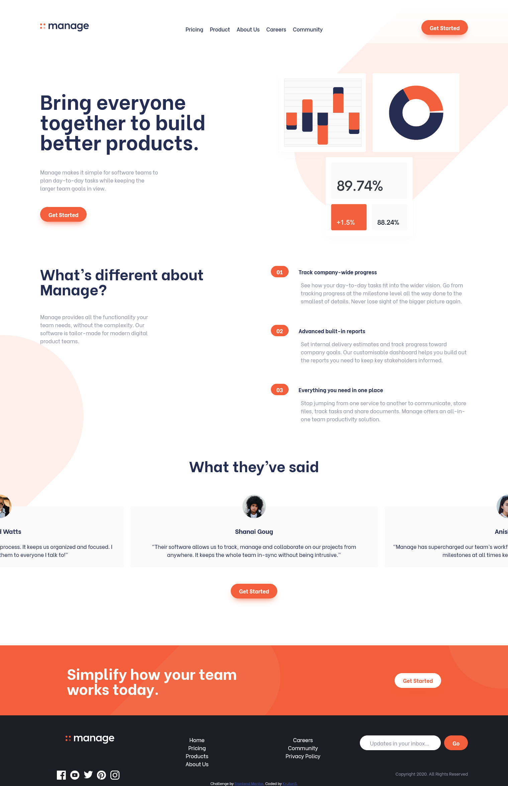

# Frontend Mentor - Manage landing page solution

This is a solution to the [Manage landing page challenge on Frontend Mentor](https://www.frontendmentor.io/challenges/manage-landing-page-SLXqC6P5). Frontend Mentor challenges help you improve your coding skills by building realistic projects. 

## Table of contents

- [Overview](#overview)
  - [The challenge](#the-challenge)
  - [Screenshot](#screenshot)
  - [Links](#links)
- [My process](#my-process)
  - [Built with](#built-with)
  - [What I learned](#what-i-learned)
  - [Continued development](#continued-development)
  - [Useful resources](#useful-resources)

**Note: Delete this note and update the table of contents based on what sections you keep.**

## Overview

### The challenge

Users should be able to:

- View the optimal layout for the site depending on their device's screen size
- See hover states for all interactive elements on the page
- See all testimonials in a horizontal slider
- Receive an error message when the newsletter sign up `form` is submitted if:
  - The `input` field is empty
  - The email address is not formatted correctly

### Screenshot



### Links
- Solution URL: [Link](https://www.frontendmentor.io/solutions/manage-landing-page-with-react-5vkrfGyjY)
- Live Site URL: [Link](https://krutons.github.io/)
## My process

### Built with

- Semantic HTML5 markup
- CSS custom properties
- Flexbox
- CSS Grid
- Mobile-first workflow
- [React](https://reactjs.org/) - JS library
- [ReactRouter](https://reactrouter.com/) - Allows to add routing to the React app
- eslint and prettier


### What I learned
This exercise was for me to learn some **React** basics and reinforce some of the knowledge I had before. I have learned **class components**, though I preferred to use **function components** with **hooks** like `useState`, `useEffect`, `useRef`, `useMemo`, `forwardRef`, `useContext` and so on.
#### Some `code` highlights
* ###### Updating `state` with `effects`
```js
	// get and update width and gap
	useEffect(() => {
		setSlideData({
			width: props.slideRef.current !== undefined ? props.slideRef.current.clientWidth : 0,
			gap: parseInt(
				window.getComputedStyle(containerRef.current).getPropertyValue('column-gap')
			)
		});
	}, [props.slideRef, isMobile]);
```
* ###### `Forwarding ref` to use in Slideshow
```js
const Opinion = forwardRef((props, ref) => {
	return (
		<div className={props.className} id={props.id} ref={ref}>
			
			<h3>{props.fullName}</h3>
			<blockquote>{props.children}</blockquote>
		</div>
	);
});
Opinion.displayName = 'Slideshow-slide';
```
* ###### isMobile `Context` managed with `custom hook`
```js
function useCheckIfMobileState() {
	const queryList = window.matchMedia('(min-width:1000px)');
	const [isMobile, setIsMobile] = useState(!queryList.matches);
	useEffect(() => {
		const listener = () => setIsMobile(!queryList.matches);
		queryList.addEventListener('change', listener);
		return () => queryList.removeEventListener('change', listener);
	}, [queryList]);
	return isMobile;
}
```
```js
	<MobileScreenContext.Provider value={useCheckIfMobileState()}>
		<AppHeader />
		<Main />
		<Footer />
	</MobileScreenContext.Provider>
```
#### And so on...
The hardest component was possibly the Slideshow, as it was the most interactive part of the page. [Code here](https://github.com/KrutonS/manage-landing-page/tree/main/src/common/slideshow)
Side effect of working on this website was also learning about `eslint`, `prettier` and integrating them together with `React` and `VS Code` as external files.

#### Lazybones Confession
I've added React Router, but... I didn't feel the need to work on the subpages. Basically there is nothing on them for now. I have some upcoming next projects and another technologies to learn. 

### Continued development
So the next fun project would be a vegan shopping website for - a client! No longer creating for my own sake.
This time I'm going to use **TypeScript** to understand it better than just the basics.
For the next projects I'm looking forward to using some React framework - **Gatsby**.
[This challenge](https://www.frontendmentor.io/challenges/rest-countries-api-with-color-theme-switcher-5cacc469fec04111f7b848ca) is looking good too.

### Useful resources

- [This](https://medium.com/how-to-react/config-eslint-and-prettier-in-visual-studio-code-for-react-js-development-97bb2236b31a) and [that](https://www.npmjs.com/package/eslint-plugin-jest) helped me out to configure all the eslint and prettier stuff. Really recommend it for other devs.

